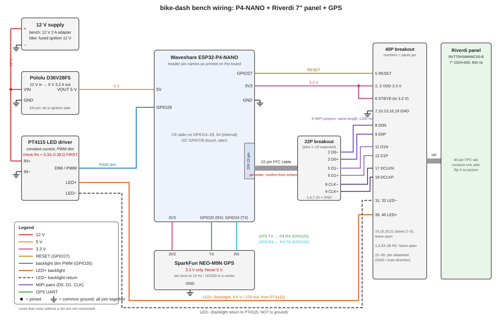
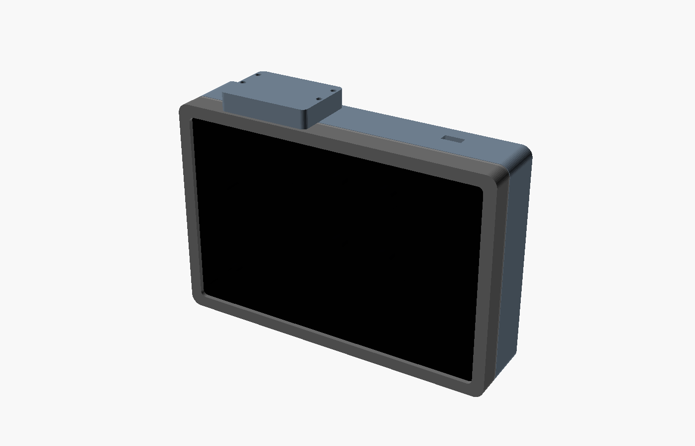

# bike-dash-build

Hardware + software build notes for the **permanent** electric-motorcycle dash.
This repo is the "how to build it" companion to two existing repos:

| Repo | What it holds |
|---|---|
| [pantsnotnecessary/bike-dash](https://github.com/pantsnotnecessary/bike-dash) (private) | The dash firmware (ESPHome/LVGL): GPS speed, BMS status, media strip, SD ride log |
| [pantsnotnecessary/ant-bms-epaper-gauge](https://github.com/pantsnotnecessary/ant-bms-epaper-gauge) (public) | The original e-paper SOC gauge; the ANT-BMS BLE logic came from here |

## The decision (2026-09-18)

Cost is not a factor. Performance and start-up time are.

| Question | Answer |
|---|---|
| Compute | **ESP32-P4 + ESP32-C6** under ESPHome. About 3 s from key-on to a usable screen. Everything already written for bike-dash carries over. |
| Why not a Pi / Linux board | 15-30 s boot. Rejected. |
| Why not STM32H7 | Under 1 s boot but no BLE and nothing carries over. Rejected. |
| Why not the Waveshare ESP32-P4-7B we started on | Its panel is **350 nits, 0-60 C**. Every ESP32-P4 all-in-one board on the market (Waveshare, Guition, Elecrow) is an indoor panel. A bike dash in direct sun needs about 1000 nits. |
| Screen | **Riverdi RVT70HSMNWC00-B**: 7" 1024x600 IPS, **850 cd/m2**, optically bonded PCAP touch, anti-glare, **-20 to 70 C**, glove and wet-screen touch. Controller EK79007 (same family as Espressif's own dev panel), runs 2-lane. |
| Board | **Waveshare ESP32-P4-NANO** (P4 + onboard C6, 32 MB PSRAM, 16 MB flash, microSD, 22-pin 2-lane DSI). |
| Glue | Two FPC breakouts for the bench, a PT4115 constant-current driver for the 9.6 V / 270 mA backlight, a Pololu 5 V buck off the bike's 12 V. A small carrier PCB replaces the breakouts for the on-bike install. |

## Bench wiring at a glance

Full pin-by-pin steps, checks and troubleshooting: [docs/wiring.md](docs/wiring.md).

## Where things are

| File | Contents |
|---|---|
| [docs/bom.md](docs/bom.md) | Every part, price, link, and order status |
| [docs/wiring.md](docs/wiring.md) | **Pin-for-pin wiring guide.** Start here when the parts arrive. |
| [docs/hardware.md](docs/hardware.md) | Pinouts, panel electrical limits, timings, gotchas (the reference behind the wiring guide) |
| [docs/software.md](docs/software.md) | ESPHome bring-up plan, versions, stages |
| [esphome/bike-dash-p4nano.yaml](esphome/bike-dash-p4nano.yaml) | Starting config: P4-NANO + Riverdi panel as a `mipi_dsi` CUSTOM model |
| [docs/build-log.md](docs/build-log.md) | Dated log of what was done and what was learned |
| [enclosure/](enclosure/README.md) | OpenSCAD model, STLs and previews of the printed housing (bezel, retainer, shell, GPS cap) |

## Enclosure at a glance

Four printed parts, PETG/ASA, M3 inserts. Details, hardware list and the VERIFY table: [enclosure/README.md](enclosure/README.md).

## Status

- 2026-09-18: research done, all core parts ordered (Amazon plus the Riverdi panel from DigiKey). Nothing built yet.
- 2026-09-18: enclosure mockup modelled in OpenSCAD, STLs exported. Several dimensions still need calipers on the real parts (see enclosure/README.md).
